# Login Flow Analysis

## Problem Identified
The login process is failing due to a **Cookie Authentication Issue**. Here's what's happening:

## Mermaid Flow Diagram


## Root Cause Analysis

### ✅ What's Working:
1. **Login API Success**: Backend returns 200 OK
2. **Cookie Set Correctly**: `Set-Cookie` header present with proper attributes
3. **JWT Token Generated**: Valid access token in response
4. **CORS Configuration**: Proper `access-control-allow-credentials: true`

### ❌ **CONFIRMED PROBLEM**: 
**Cookie is NOT being sent by browser in subsequent requests**

从Debug日志可以看到：

**后端设置Cookie成功:**
```
[AUTH CONTROLLER DEBUG] Setting cookie with options: {
  cookieName: 'access_token',
  cookieOptions: {
    httpOnly: true,
    secure: false,
    sameSite: 'strict',  ← 这是问题根源！
    maxAge: 604800000,
    path: '/'
  }
}
```

**前端接收到Set-Cookie头:**
```
'set-cookie': 'access_token=...SameSite=Strict'
```

**但后续请求时Cookie为空:**
```
[JWT STRATEGY DEBUG] Extracting token from cookies: {
  allCookies: [Object: null prototype] {},  ← 完全为空！
  targetCookie: 'access_token',
  foundToken: false,
  tokenLength: 0
}
```

## Detailed Cookie Analysis

### Cookie Attributes from Response:
```
Set-Cookie: access_token=eyJhbGciOiJIUzI1NiIsInR5cCI6IkpXVCJ9...; 
Max-Age=604800; 
Path=/; 
Expires=Tue, 16 Sep 2025 14:48:25 GMT; 
HttpOnly; 
SameSite=Strict
```

### Potential Issues:

1. **SameSite=Strict**: This is the most likely culprit
   - `SameSite=Strict` blocks cookies in cross-site requests
   - Even though both frontend (5173) and backend (3000) are localhost, they're different ports
   - Browser may treat them as different sites

2. **HttpOnly Flag**: Cookie can't be accessed by JavaScript (this is actually good for security)

3. **Cross-Origin Cookie Issues**: Different ports might cause cookie isolation

## Flow Breakdown:

```mermaid
graph TD
    A[User submits login] --> B[POST /auth/login]
    B --> C[Backend validates & returns cookie]
    C --> D[Frontend redirects to /users]
    D --> E[GET /users request]
    E --> F{Cookie sent?}
    F -->|No| G[401 Unauthorized]
    F -->|Yes| H[Users data returned]
    G --> I[Redirect to /login]
    I --> J[Infinite Loop! 🔄]
    
    style F fill:#ff9999
    style G fill:#ff9999
    style I fill:#ff9999
    style J fill:#ff6666
```



## The Redirect Loop:
1. Login succeeds → redirect to `/users`
2. `/users` loader runs → cookie missing → 401 error
3. 401 error → redirect to `/login`
4. User still "logged in" → redirect to `/users` 
5. **LOOP CONTINUES**

## ✅ Confirmed Solutions (Based on Google Research):

### **Primary Solution - Change SameSite Policy:**
1. **For Development**: Change `SameSite=Strict` to `SameSite=Lax`
   - `Lax` allows cookies in cross-site navigation but blocks in cross-site requests
   - Works for localhost development with different ports

2. **For Production**: Use `SameSite=None` with `Secure=true` 
   - Requires HTTPS in production
   - Allows all cross-site cookie usage

### **Alternative Solutions:**
3. **Same Port Approach**: Serve React from NestJS backend (same port)
4. **Custom Domain**: Use custom domains instead of different localhost ports  
5. **JWT in LocalStorage**: Remove HttpOnly and store JWT client-side (less secure)

### **Backend Configuration Needed:**
```typescript
// In NestJS - Change cookie settings
res.cookie('access_token', token, {
  httpOnly: true,
  sameSite: 'lax', // Change from 'strict' to 'lax'
  // or for production with HTTPS:
  // sameSite: 'none',
  // secure: true
});
```

### **CORS Must Allow Credentials:**
```typescript
app.enableCors({
  origins: ['http://localhost:5173'], // React frontend URL
  credentials: true, // Critical for cookie authentication
});
```